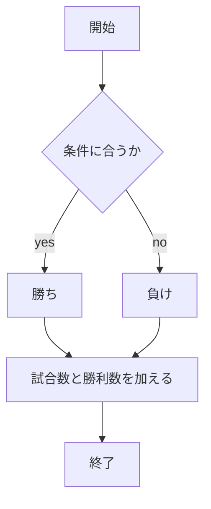
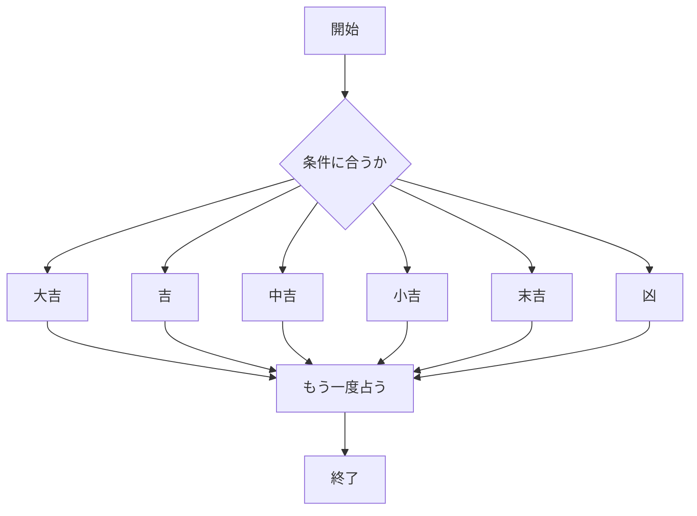
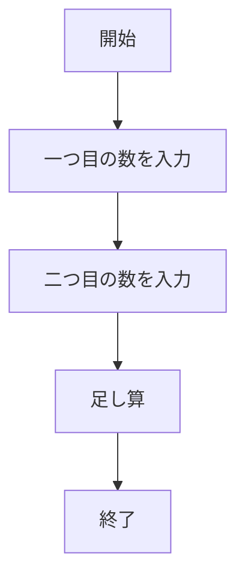
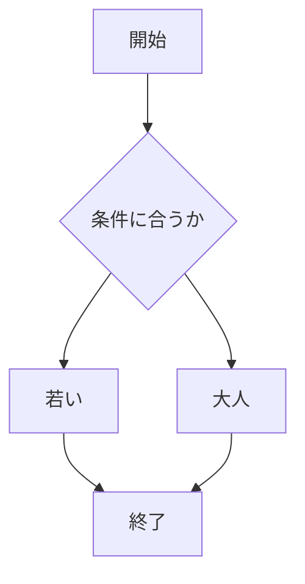

# webpro_06

## このプログラムについて

このリポジトリは,Express を使用した Web アプリケーションで,複数の機能（運勢占い、じゃんけん、計算機能、年齢チェックなど）を提供する.本ドキュメントでは,アプリケーションの起動方法やGitでの管理方法,各機能の詳細な使用方法を説明する.
## ファイル一覧
ファイル名 | 説明
-|-
add5.js | プログラム本体
  /index.ejs          | トップページ（リンク集）
  /henken.ejs         | 占いの入力フォーム
  /henken-result.ejs  | 占い結果表示ページ
  /janken.ejs         | じゃんけんページ
  /luck.ejs           | 運勢占い結果ページ
  /age.ejs            | 年齢入力フォーム
  /calculator.ejs     | 計算機能ページ
  /result.ejs         | 計算結果や年齢結果の表示ページ
/package.json         | Node.js の依存関係
##  プロジェクトの概要

このアプリケーションは,Express フレームワークを使用して開発され,以下の機能を提供する.
- **じゃんけんゲーム** (`/janken`)
- **年齢チェック** (`/age`)
- **計算機能** (`/calculator`)
- **占い機能** (`/henken`)

##  起動方法
1. ターミナルで```add5.js``` を起動する
2. Webブラウザで[localhost:8080](http://localhost:8080)にアクセスする
## 使用方法
ファイル名|起動後
-|-
ジャンケン|自分の手を入力
年齢チェック|年齢を入力
計算機能|任意の二つの数を入力
占い|好みの数字を入力

## Git でのファイル管理

**リポジトリをクローン**:

   以下のコマンドでリポジトリをクローンする.

   ```bash
   git clone https://github.com/your-username/repository-name.
```
## 変更のコミットとプッシュ
ソースコードに変更を加えた後,変更を Git にコミットする.例えば,新しい機能を追加した場合やバグ修正を行った場合
```bash
git add .
git commit -m "追加/修正内容を簡潔に説明"
git push
```

# 実装内容
## 　ジャンケン
```javascript
app.get("/janken", (req, res) => {
  let hand = req.query.hand;
  let win = Number(req.query.win) || 0;
  let total = Number(req.query.total) || 0;
  console.log({ hand, win, total });

  const num = Math.floor(Math.random() * 3 + 1);
  let cpu = '';
  if (num == 1) cpu = 'グー';
  else if (num == 2) cpu = 'チョキ';
  else cpu = 'パー';

  let judgement = '';
  if (hand === cpu) {
    judgement = '引き分け'; // Draw
  } else if (
    (hand === 'グー' && cpu === 'チョキ') || // グーがチョキに勝つ
    (hand === 'チョキ' && cpu === 'パー') || // チョキがパーに勝つ
    (hand === 'パー' && cpu === 'グー')       // パーがグーに勝つ
  ) {
    judgement = '勝ち'; // Win
    win += 1; // 勝ち数を増やす
  } else {
    judgement = '負け'; // Lose
  }

  total += 1;
  const display = {
    your: hand,
    cpu: cpu,
    judgement: judgement,
    win: win,
    total: total
  };
  res.render('janken', display);
});
```
##　年齢チェック

```javascript
app.get("/age", (req, res) => {
  res.render('age');
});

app.post("/age", (req, res) => {
  const age = parseInt(req.body.age, 10);
  let message = '';

  if (isNaN(age)) {
    message = '年齢を入力してください';
  } else if (age < 20) {
    message = '若いですね！';
  } else {
    message = '大人ですね！';
  }

  res.render('result', { message: message });
});
```
## 計算機能
```javascript
app.get("/calculator", (req, res) => {
  res.render('calculator');
});

app.post("/calculator", (req, res) => {
  const num1 = parseFloat(req.body.num1);
  const num2 = parseFloat(req.body.num2);
  
  if (isNaN(num1) || isNaN(num2)) {
    res.render('result', { message: '有効な数値を入力してください' });
  } else {
    const sum = num1 + num2;
    res.render('result', { message: `計算結果: ${sum}` });
  }
});
app.get("/", (req, res) => {
  res.render('index');
});
```
## 占い
```javascript
app.post("/henken-result", (req, res) => {
  const userNumber = req.body.userNumber;  // ユーザーが入力した数字を取得
  
  // 数字が1〜100の範囲内か確認
  const num = parseInt(userNumber);
  let fortune = "";  // 結果を格納する変数
  
  if (isNaN(num) || num < 1 || num > 100) {
    fortune = "1〜100の数字を入力してください！";
  } else {
    const randomSeed = num % 10;  // 数字の一部を運勢の決定に使う

    // 運勢を決定
    switch (randomSeed) {
      case 0:
        fortune = "大吉！全てうまくいくでしょう！";
        break;
      case 1:
      case 2:
        fortune = "吉！少しの努力で良い結果が得られます。";
        break;
      case 3:
      case 4:
        fortune = "中吉！着実に進むことで幸運が訪れます。";
        break;
      case 5:
      case 6:
        fortune = "小吉！思わぬところにチャンスが隠れています。";
        break;
      case 7:
      case 8:
        fortune = "末吉！運は少しずつ開けていきます。";
        break;
      case 9:
        fortune = "凶…慎重に行動することをおすすめします。";
        break;
      default:
        fortune = "運勢の結果が読み取れませんでした。";
    }
  }

  // 結果をレスポンスとして返す
  res.render('henken-result', { result: fortune });  // fortune 変数を使用
});
```

## 機能の説明
このアプリケーションでは,以下の機能を提供している.
## ジャンケン
**機能**: ユーザーとコンピュータがじゃんけんを行い,勝敗を判定する.ユーザーは「グー」「チョキ」「パー」を選択できる.勝敗はサーバー側で決定され,結果（勝ち,負け,引き分け）を表示する.
勝ち数と総回数はリクエストごとにカウントされる.
**使用方法**:/janken にアクセスし,フォームで「グー」「チョキ」「パー」のいずれかを選択すると,勝敗結果が表示される.
## 年齢入力
**機能**: ユーザーが自分の年齢を入力し,その年齢に基づいてメッセージを表示する.年齢が20歳未満の場合は「若いですね！」,それ以上の場合は「大人ですね！」と表示される.
**使用方法**:/age にアクセスし,年齢をフォームで入力し,送信ボタンを押すと,年齢に基づいたメッセージが表示される.

## 計算機能
**機能**: ユーザーが2つの数値を入力し,加算や減算,乗算などの計算を行う.
**使用方法**:/calculator にアクセスし,2つの数値を入力し,計算ボタンを押すと,計算結果が表示される.

## 占い
**機能**: ユーザーが1〜100の数字を入力し,その数字をもとに運勢を占う.占いの結果は「大吉」「吉」「中吉」などだ.
**使用方法**:/henken にアクセスし,1〜100の数字を入力し,「占う」ボタンを押すと,占い結果が表示される.

## ジャンケンのフローチャート

## 運勢のフローチャート

## 計算のフローチャート

## 年齢のフローチャート

